

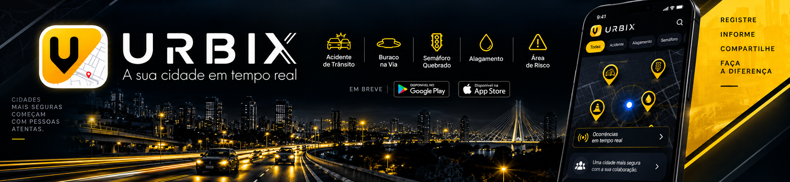

**Documento mestre de planejamento · Versão 1.0 · 17/09/2026**

  

> [!IMPORTANT]
> **Este documento registra decisões de produto e propostas técnicas, não uma auditoria do código.** As tecnologias, os custos e os prazos dependem da inspeção do projeto existente. O wireframe será produzido em outra etapa.

## Índice

1. [Visão e público](#1-visão-e-público)
2. [Navegação e telas](#2-navegação-e-telas)
3. [Categorias de ocorrências](#3-categorias-de-ocorrências)
4. [Confiabilidade, status e histórico](#4-confiabilidade-status-e-histórico)
5. [Inteligência artificial e moderação](#5-inteligência-artificial-e-moderação)
6. [Alertas personalizados](#6-alertas-personalizados)
7. [Gamificação](#7-gamificação)
8. [Privacidade e segurança](#8-privacidade-e-segurança)
9. [Emergências](#9-emergências)
10. [Monetização](#10-monetização)
11. [Arquitetura técnica preliminar](#11-arquitetura-técnica-preliminar)
12. [Cronograma por fases](#12-cronograma-por-fases)
13. [Escopo do MVP e evolução](#13-escopo-do-mvp-e-evolução)
14. [Pendências e preparação](#14-pendências-e-preparação)
15. [Próxima entrega](#15-próxima-entrega)

---
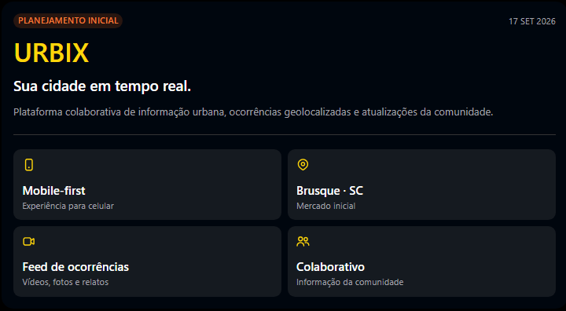

## 1. Visão e público

**URBIX — sua cidade em tempo real** é uma proposta de plataforma colaborativa de ocorrências urbanas: 
cidadãos publicam vídeos, fotos ou relatos, consultam um feed geolocalizado e acompanham atualizações sobre acontecimentos na cidade.

**Problema:** informações sobre acidentes, alagamentos, bloqueios e outros eventos estão dispersas; nem sempre é fácil encontrar o local, 
o horário ou a situação atual. **Hipótese de valor a testar:** reunir feed, mapa, histórico e colaboração em uma experiência 
mobile-first será útil para decisões cotidianas. 
O aplicativo não será apenas uma rede social de vídeos. Ele combinará três elementos centrais:

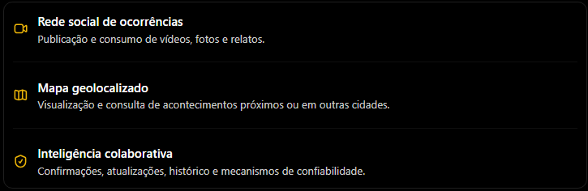

**1.1 Problema que queremos resolver** 
As informações sobre acidentes, alagamentos, bloqueios e outros acontecimentos urbanos estão espalhadas entre redes sociais, grupos de mensagens e sites de notícias.
Uma pessoa pode descobrir que houve um acidente, mas não conseguir identificar facilmente o local, o horário do registro ou se a situação já foi resolvida.
O URBIX pretende organizar essas informações em um ambiente geolocalizado, permitindo que os próprios cidadãos contribuam para mantê-las atualizadas.
O diferencial que pretendemos testar é a combinação de vídeo, localização, histórico e confirmação comunitária em uma única experiência.

**1.2 Público-alvo** 
| Quem usa | porque? |
|---|---|
| Público | Utilidade principal |
| Moradores | Acompanhar acontecimentos da cidade |
| Motoristas | Consultar acidentes, bloqueios e condições das vias |
| Motoristas de aplicativo | Obter informações sobre regiões e trajetos |
| Pessoas que viajam | Consultar acontecimentos na cidade de destino |
| Cidadãos colaboradores | Publicar e atualizar ocorrências |
| Órgãos públicos | Possível uso institucional futuro |

**Lançamento previsto:** Brusque (SC); expansão para Santa Catarina, Brasil e outros países é uma ambição futura, não um cronograma aprovado.

## 2. Navegação e telas 
Definimos cinco áreas na navegação inferior.

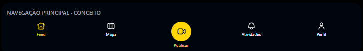

### 2.1 Feed (tela inicial)

Essa representação serve apenas para registrar a organização dos menus. O design definitivo será desenvolvido no wireframe.
Funcionalidades previstas:

| Funcionalidade | Comportamento |
|---|---|
| Reprodução de vídeos | Vídeos apresentados verticalmente |
| Fotos | Publicações com imagens estáticas |
| Relatos em texto | Ocorrências sem necessidade de mídia |
| Data e hora | Horário do acontecimento, quando informado, e horário da publicação |
| Localização | Identificação da região da ocorrência |
| Status | Indicação visual da situação atual |
| Filtros | Seleção por categoria de ocorrência |
| Interações | Comentários, compartilhamento e salvamento |
| Resumo por IA | Acesso opcional ao resumo textual ou em áudio |

**Uma distinção importante:** a data e a hora do envio não comprovam quando o acontecimento ocorreu. 
O sistema deverá armazenar esses horários separadamente.

**Organização de vídeos da mesma ocorrência**
Quando várias pessoas registrarem um único acontecimento, seus vídeos poderão ser associados ao mesmo evento.

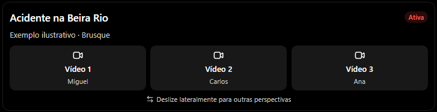

A navegação vertical continuará levando à próxima ocorrência. A navegação horizontal permitirá explorar outras contribuições do mesmo acontecimento.
O sistema tentará identificar automaticamente publicações relacionadas, com possibilidade de corrigir agrupamentos incorretos.

### 2.2 Mapa

- Mapa interativo com movimentação e zoom, em experiência próxima a um aplicativo convencional de mapas.
- **Pinos discretos** por ocorrência; avaliar agrupamento visual de pinos quando houver alta densidade.
- Toque no pino abre um **balão compacto** com tipo, local, horário e status; tocar em outro substitui o anterior; tocar em área vazia fecha o balão.
- Ações no balão: **Traçar rota**, **Comentar** e **Assistir** (abre a publicação no feed).
- Primeira versão pode abrir rotas em aplicativo externo; navegação GPS própria não é necessária no início.
- **Segurança:** não incentivar deslocamento até acidentes, crimes ou desastres; apresentar alternativas para consultar/evitar a região quando apropriado.
- Google Maps Platform é uma candidata, não uma escolha fechada; confirmar licenças, recursos e custos antes da implementação. 

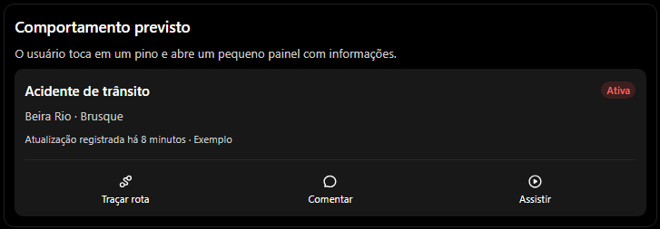

### 2.3 Publicar (botão central)

Botão circular de câmera, integrado à navegação inferior, com pulsação discreta. Fluxo: escolher mídia (**vídeo, foto ou texto**), informar categoria, descrição e localização, enviar e acompanhar a triagem. A localização deve ter autorização e alternativas de preenchimento quando indisponível.

### 2.4 Atividades

A quarta aba será uma **central de atividades**, não um chat privado na primeira versão. Reúne ocorrências comentadas/salvas, respostas, mudanças de status e acesso de volta ao post. O usuário pode **silenciar notificações** ou **arquivar** uma ocorrência da sua central, sem removê-la do feed público. Mensagens privadas ficam para avaliação futura.

### 2.5 Perfil

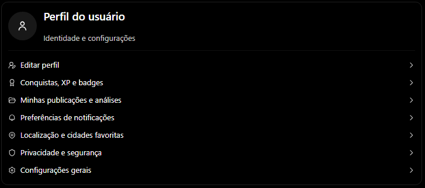

Cadastro obrigatório para acessar o app, com possibilidade de **publicar anonimamente perante outros usuários**. A aba inclui: editar perfil; minhas publicações (publicadas, em análise e recusadas, com motivos e revisão); conquistas e XP; preferências de notificações; cidades favoritas e localização; privacidade, segurança e configurações gerais.

---

## 3. Categorias de ocorrências

Estrutura configurável para incluir novos tipos sem alterar a navegação principal.

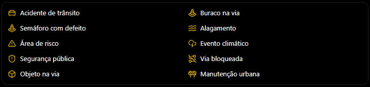

**Atenção:** relatos de crime e situações com vítimas demandam moderação e linguagem próprias; categoria não representa confirmação dos fatos.

## 4. Confiabilidade, status e histórico

Duas dimensões independentes: **(a) o acontecimento foi corroborado?** e **(b) qual é a situação atual?** Badges do autor e tempo de uso **não são provas** de veracidade.

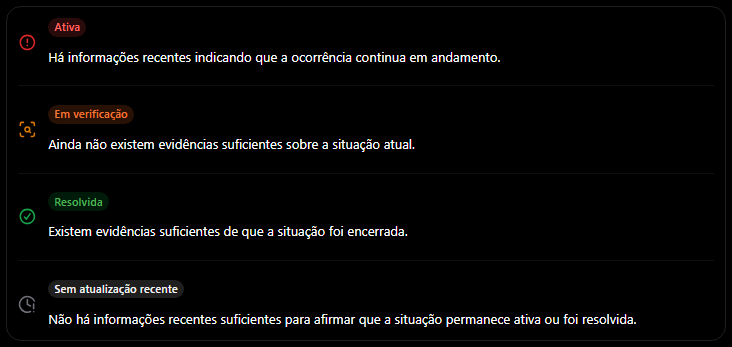.

**Veracidade separada:** um relato recém-publicado pode ser rotulado como *ainda não corroborado*; outros relatos ou fontes podem corroborar o acontecimento sem necessariamente confirmar sua situação atual.

### Confirmação presencial

- Qualquer pessoa cadastrada pode **visualizar** os registros; apenas pessoas próximas podem enviar **confirmação presencial**.
- **Raio inicial para testes: 100 m**, sujeito à precisão do GPS, obstáculos, categoria e validação do backend. Estar no raio não prova que a pessoa viu o evento; localização pode ser falsificada.
- A hipótese de **duas ou três confirmações** não é regra definitiva: testar independência de relatos, abuso por contas múltiplas, histórico e contradições.
- Não incentivar que alguém se aproxime de um local perigoso para ganhar XP ou confirmar um relato.

### Agrupamento e histórico

Uma postagem continua sendo feita normalmente. O sistema **tenta associá-la** a um acontecimento já existente com base em local, tempo, categoria, texto e, quando viável, mídia. O agrupamento precisa permitir **correção de associações equivocadas**. Cada acontecimento pode ter vários vídeos, mas um único ponto correspondente no mapa.
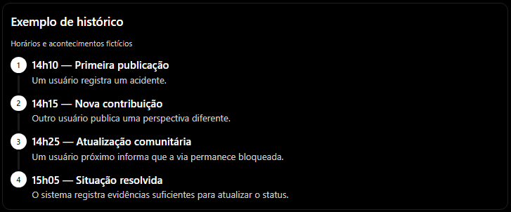.
Uma **linha do tempo** registra publicação inicial, novos ângulos, confirmações e mudanças de status. Tocar na tarja abre um **painel de baixo para cima**; o vídeo pausa e o painel fecha deslizando para baixo. Ocorrência antiga não vira “resolvida” apenas porque não houve novidades: muda para *sem atualização recente* conforme regra de prazo **a definir por categoria**.

---

## 5. Inteligência artificial e moderação

A IA é **apoio à classificação e à síntese**, não uma autoridade infalível ou substituta de avaliação em casos críticos. 
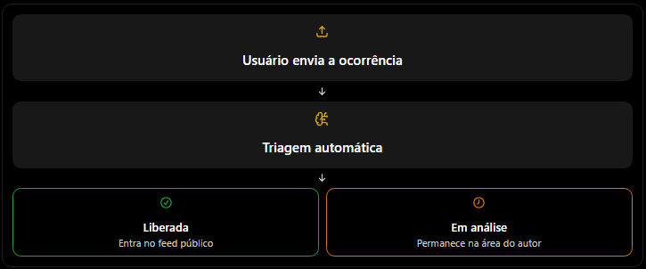.

| Módulo | Comportamento planejado | Proteção necessária |
|---|---|---|
| Triagem de publicação | Analisa vídeo, foto, texto e contexto para verificar pertinência. | Conteúdo inconclusivo fica **em análise**, com contestação/revisão. |
| Agrupamento | Sugere união de relatos sobre o mesmo evento. | Possibilidade de separar agrupamentos errados. |
| Fontes externas | Busca informações complementares, quando disponíveis e autorizadas. | Ausência de notícia **não** comprova resolução. |
| Resumo | Sintetiza relatos e atualizações em **texto**, com opção de leitura em voz alta. | Exibir fontes, horário da última evidência e incertezas. |

**Meta de triagem:** buscar liberação em cerca de **10 s para a maioria dos envios**, como objetivo a medir, **não promessa**. Vídeos podem demorar mais. Em caso de atraso ou dúvida, manter o conteúdo pendente na área do autor; não reprovar automaticamente.

O resumo será opcional: abrir painel sobre o feed, ler ou ouvir e fechar para continuar assistindo. Não inventar vítimas, culpados, causas nem estado das vias. A leitura deve parar quando o painel for fechado. 
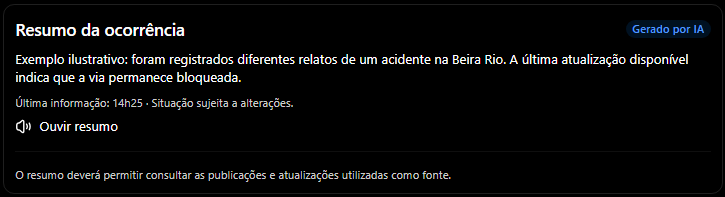.

---

## 6. Alertas personalizados

Preferências em **Perfil → Notificações**, com permissão do dispositivo e opção de desligar:

- Localização atual, cidades favoritas (ex.: Brusque e Blumenau) e exploração de cidades sem favoritá-las.
- Categoria, cidade/bairro/raio e frequência: imediata ou resumo periódico.
- Respostas a comentários e mudanças importantes de status, configuráveis de modo independente.
- Evitar alertas duplicados e excesso de notificações.

**Distinção:** os **100 m** servem como hipótese para confirmação presencial, **não** como raio geral de alerta.

## 7. Gamificação

XP, níveis e badges podem reconhecer participação útil. Exemplos **não aprovados como nomes definitivos**: Novato, Colaborador, Colaborador experiente. Pontuação não deve depender apenas da **quantidade** de posts, comentários ou confirmações, para evitar spam, fraudes e incentivo a situações perigosas. Badges não certificam verdade. **Recompensas em dinheiro** são hipótese posterior, sujeita a análise de fraude, custos e incentivos.
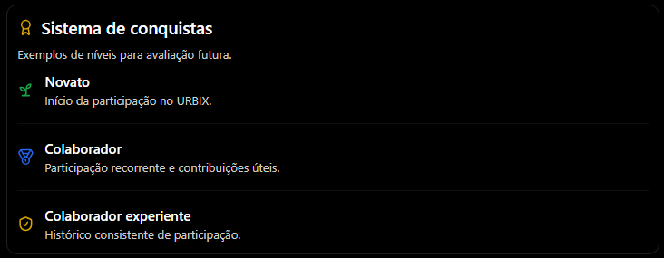.
## 8. Privacidade e segurança

- **Conta obrigatória**, com anonimato **público** opcional para uma publicação. A plataforma ainda deverá proteger e administrar dados da conta.
- Ferramentas de **detecção e desfoque de rostos e placas**, com critérios de proteção e revisão conforme o contexto. Não pressupor que toda imagem identificável seja ilegal ou irrestritamente permitida.
- Denúncia de conteúdo falso, assédio e exposição indevida; revisão e tratamento rápido de casos graves.
- Dados precisos de localização usados na validação **não devem expor a posição do colaborador** a outros usuários.
- Controle de acesso, retenção de dados, solicitações de correção/exclusão e análise jurídica antes do lançamento.
- Um termo dizendo que o autor é responsável **não isenta automaticamente a plataforma**; política e operação devem ser compatíveis com a LGPD e outras normas aplicáveis.

## 9. Emergências

Botões de acesso ao **discador telefônico**, sem prometer envio automático de ocorrência ou integração com centrais:

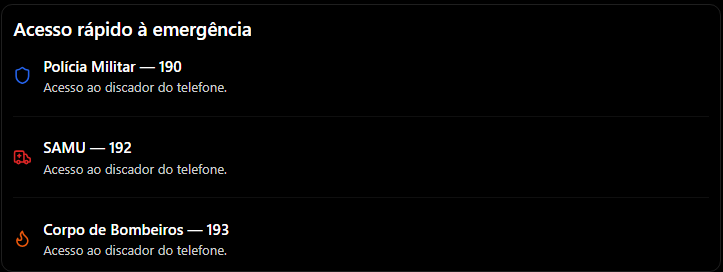.

Confirmar números, cobertura e funcionamento nas regiões de operação. **Publicar um post não equivale a pedir socorro.** Integração direta com órgãos públicos exigiria acordos e infraestrutura próprios.

## 10. Monetização

**Não definida.** Duas linhas possíveis e independentes de decisão nesta etapa:

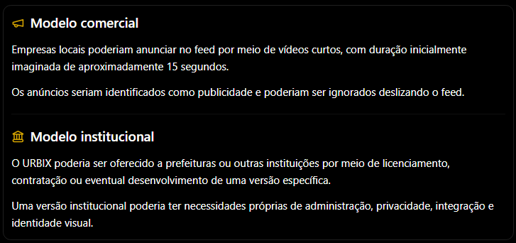.
Não construir dois produtos nem prometer receita antes de validar o uso real do núcleo do URBIX.

## 11. Arquitetura técnica preliminar

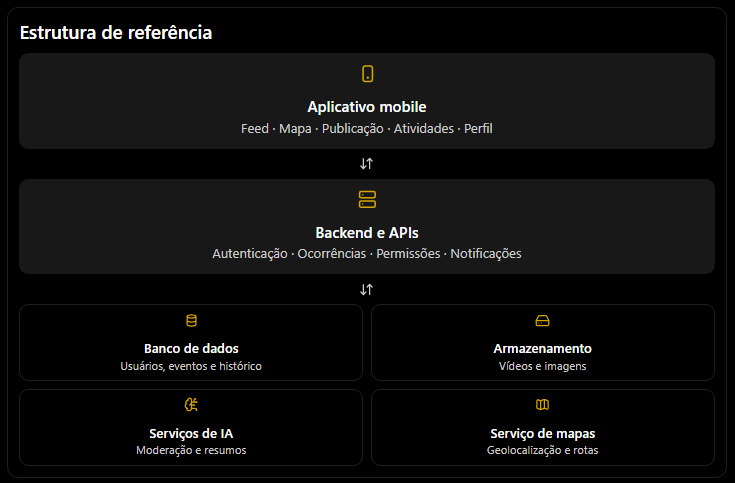.

| Área | Candidatos **a avaliar**, não escolhidos |
|---|---|
| Aplicativo | React Native + Expo ou evolução da base React existente |
| Linguagem | TypeScript |
| Backend | Supabase ou backend próprio |
| Banco | PostgreSQL com recursos geoespaciais |
| Mapas | Google Maps Platform ou alternativa compatível |
| Vídeos | Armazenamento + processamento/transcodificação de mídia |
| IA | Serviços de moderação e resumo com avaliações específicas |
| Alertas | Serviço de push compatível com dispositivos-alvo |

A definição depende de **auditoria do código**, necessidades do MVP, licenças, privacidade e custos. Para produção, prever observabilidade, backups, segurança, limites de uso e rotinas de moderação.

---

## 12. Cronograma por fases

> **Sem datas inventadas:** estimativas de duração só serão feitas após a auditoria do código e confirmação da disponibilidade de desenvolvimento. O trabalho seguirá em etapas testáveis, preservando o que funciona.
O cronograma será dividido em fases, com entregas verificáveis.
> 
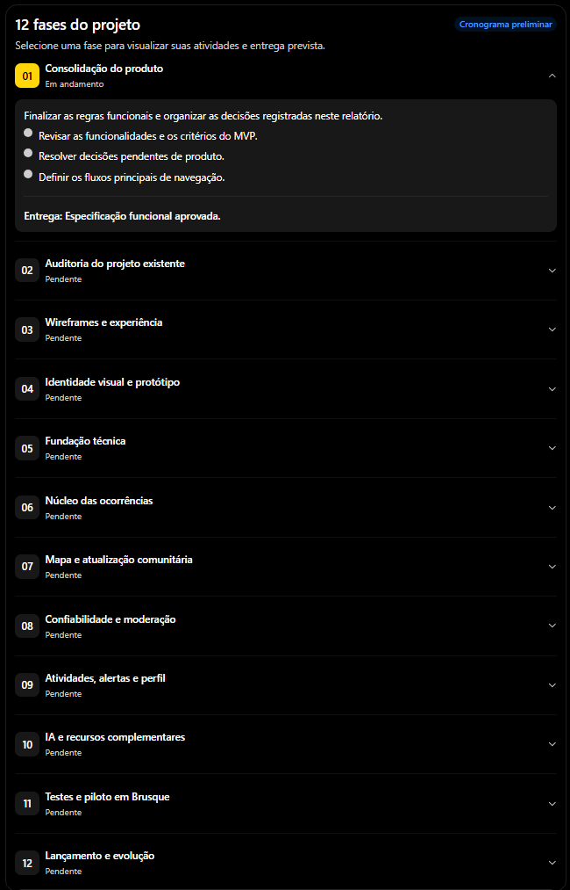.
 
A ordem das fases é uma referência de execução, não uma exigência de desenvolvimento rigidamente sequencial. Algumas atividades poderão acontecer em paralelo.

## 13. Escopo do MVP e evolução

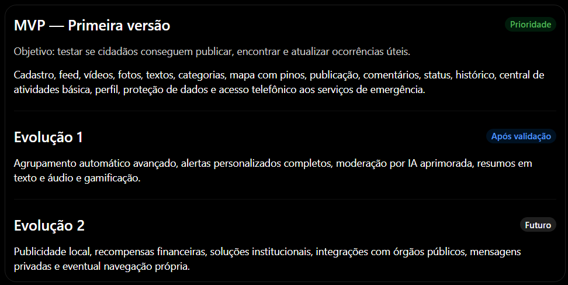
**Mesmo no MVP:** é necessário ter controles mínimos de abuso, revisão e proteção; simplificar a implementação não significa ignorar segurança.

## 14. Pendências e preparação

### Decisões a fechar

- [ ] Critérios de confirmação presencial além do raio inicial de 100 m.
- [ ] Regras para mudanças de status e relatos contraditórios.
- [ ] Prazo de “sem atualização recente” por categoria.
- [ ] Limites e correções do agrupamento automático.
- [ ] Dados mínimos do cadastro e limites do anonimato.
- [ ] Precisão de localização exibida publicamente.
- [ ] Política de denúncia, revisão humana e apelação.
- [ ] Custos de vídeo, mapas, IA, notificações e suporte.
- [ ] Equipe ou responsável pela operação e moderação.

### Material necessário para iniciar

1. Arquivo `.zip` **atual** do URBIX, incluindo `package.json`, estrutura de pastas e configurações **sem segredos**.
2. Capturas ou vídeo das telas atuais, se houver.
3. Lista dos fluxos já testados e dos problemas conhecidos.
4. Disponibilidade aproximada de tempo e orçamento, para estimar fases posteriormente.

**Não enviar:** `node_modules`, `.env` com valores reais, senhas, tokens ou chaves privadas.

## 15. Próxima entrega

**Auditar o projeto existente e depois criar o wireframe.** O wireframe deverá representar cinco abas, feed vertical + agrupamento horizontal, mapa de pinos e balões, fluxo de publicação, quatro status, histórico, central de atividades e perfil. O design definitivo e as datas dependem da validação das etapas anteriores.

---

**URBIX · Sua cidade em tempo real.**  
*Planejar → Validar → Construir → Testar → Evoluir.*

